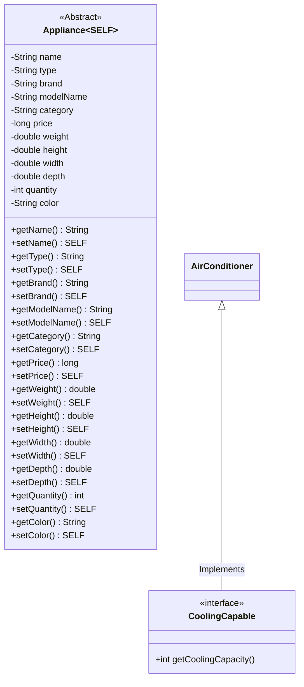

```mermaid
classDiagram
    class Appliance~SELF~ {
        -String name
        -String type
        -String brand
        -String modelName
        -String category
        -long price
        -double weight
        -double height
        -double width
        -double depth
        -int quantity
        -String color
        
        +getName() String
        +setName() SELF
        +getType() String
        +setType() SELF
        +getBrand() String
        +setBrand() SELF
        +getModelName() String
        +setModelName() SELF
        +getCategory() String
        +setCategory() SELF
        +getPrice() long
        +setPrice() SELF
        +getWeight() double
        +setWeight() SELF
        +getHeight() double
        +setHeight() SELF
        +getWidth() double
        +setWidth() SELF
        +getDepth() double
        +setDepth() SELF
        +getQuantity() int
        +setQuantity() SELF
        +getColor() String
        +setColor() SELF
    }
    
    <<Abstract>> Appliance


    class CoolingCapable {
        +int getCoolingCapacity()
    }
    <<interface>> CoolingCapable
    
    class AirConditioner {
    
    }
    AirConditioner <|-- CoolingCapable : Implements
```